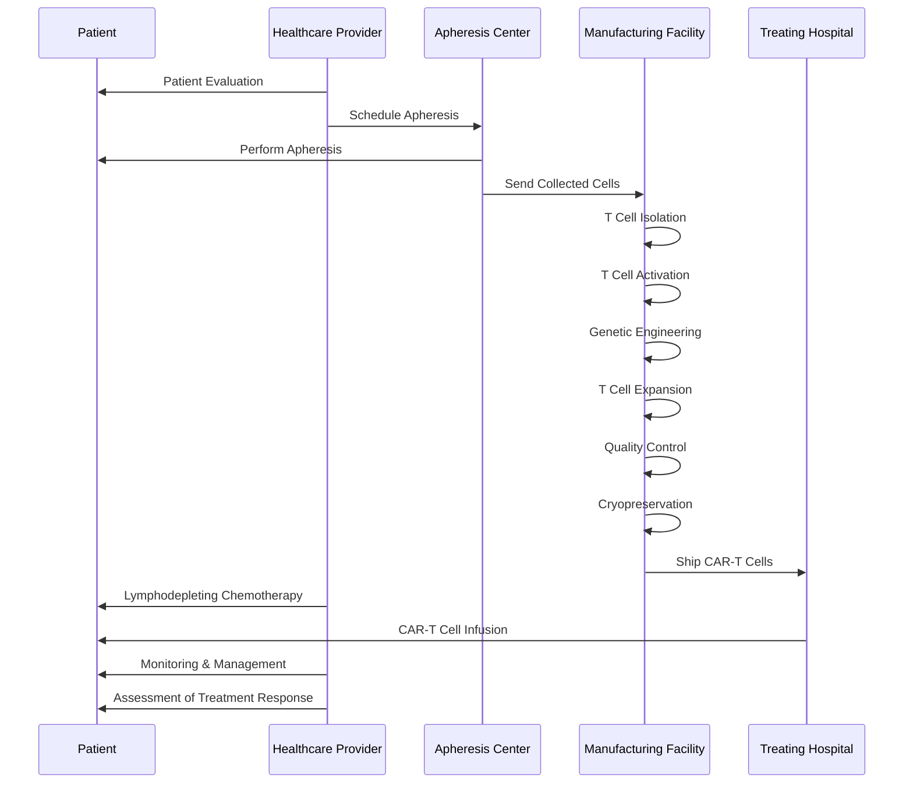

# CAR-T Business Flow

## Mermaid Model

```mermaid
sequenceDiagram
participant Patient
participant Healthcare Provider
participant Apheresis Center
participant Manufacturing Facility
participant Treating Hospital

Healthcare Provider->>Patient: Patient Evaluation
Healthcare Provider->>Apheresis Center: Schedule Apheresis
Apheresis Center->>Patient: Perform Apheresis
Apheresis Center->>Manufacturing Facility: Send Collected Cells
Manufacturing Facility->>Manufacturing Facility: T Cell Isolation
Manufacturing Facility->>Manufacturing Facility: T Cell Activation
Manufacturing Facility->>Manufacturing Facility: Genetic Engineering
Manufacturing Facility->>Manufacturing Facility: T Cell Expansion
Manufacturing Facility->>Manufacturing Facility: Quality Control
Manufacturing Facility->>Manufacturing Facility: Cryopreservation
Manufacturing Facility->>Treating Hospital: Ship CAR-T Cells
Healthcare Provider->>Patient: Lymphodepleting Chemotherapy
Treating Hospital->>Patient: CAR-T Cell Infusion
Healthcare Provider->>Patient: Monitoring & Management
Healthcare Provider->>Patient: Assessment of Treatment Response

```
